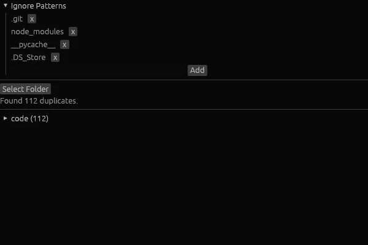

# Find Duplicates

A desktop application to find duplicate files across directories. Built with Rust and [egui](https://github.com/emilk/egui).



## How it works

1. Select a folder to scan
2. The app groups files by size, then compares the first 4KB of each file with matching sizes
3. Duplicates are displayed in a tree view grouped by directory

## Features

- Configurable ignore patterns
- Tree view of duplicates grouped by folder

## Build

```bash
cargo build --release
```
