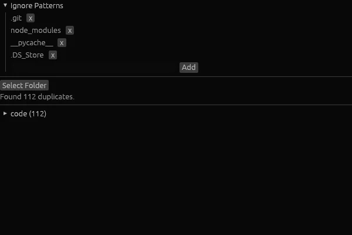

# Find Duplicates

A desktop application to find duplicate files across directories. Built with Rust and [egui](https://github.com/emilk/egui).



## How it works

1. Select a folder to scan (or pass it as an argument: `find-duplicates /mnt/disk`)
2. Files are grouped by size, then compared with xxh3: first a quick hash of the first and last 4 KB, then the full content for the remaining matches
3. Folders that are copies of each other are detected by matching the paths of identical files (e.g. `Backups/PC/Docs/a.pdf` and `Old/Docs/a.pdf` point to `Backups/PC/Docs` ↔ `Old/Docs`), and every candidate pair is measured: how many of each folder's files exist in the other

## Features

- **Similar folders**: pairs of folders classified as identical, contained (one is a subset of the other, so it can be deleted safely) or similar, with the % of files of each folder found in the other
- **Side-by-side comparison** of a pair: same files, modified (same name, different content), moved/renamed, and files that exist on only one side
- **Duplicate files** grouped by content and sorted by wasted space
- **Treemap** of the disk coloured by how much of each folder is duplicated
- Hash cache between scans (in the OS cache dir, e.g. `~/.cache/find-duplicates/hashes.bin`), invalidated by size and modification time
- Quick scan mode, minimum file size and ignore patterns

## Build

```bash
cargo build --release
```
